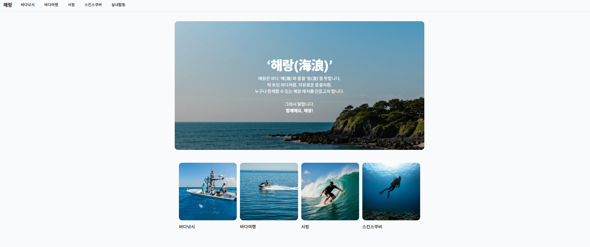
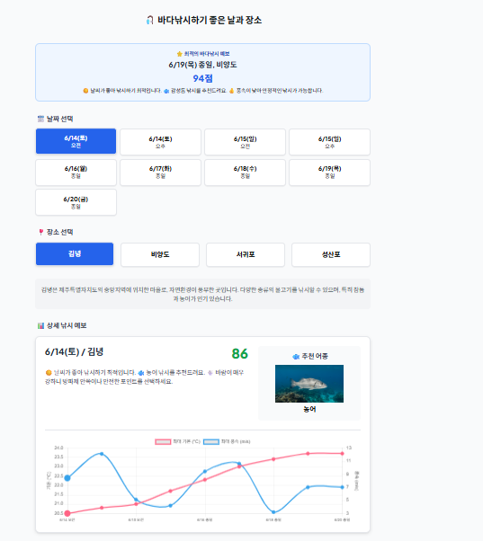
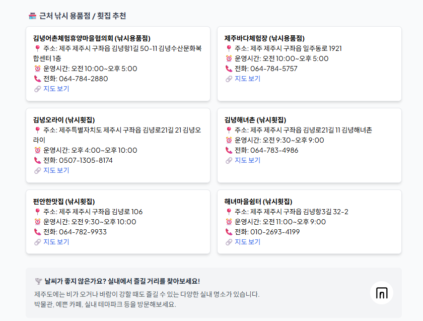
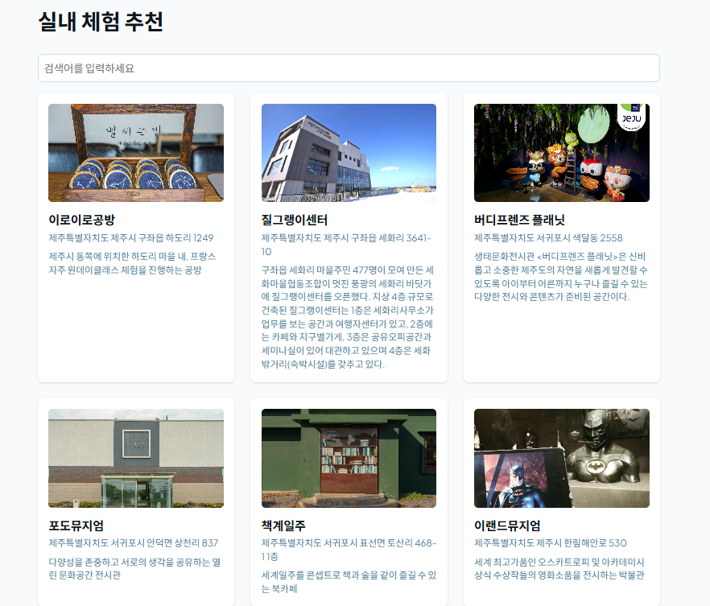

# MS_AI_1st_project

## 프로젝트 기획 의도
제주를 찾는 관광객과 현지인에게 서핑, 스킨스쿠버, 바다낚시 등 해양 레저 스포츠 정보를 일원화하여 제공하고, 실시간 해양·기상 데이터를 활용해 사용자의 수준과 취향, 날짜에 최적화된 레저 활동 추천 서비스를 제공합니다. 비/태풍 등 기상 특보 시에는 실내 체험 활동을 안내하여 예약, 강습 정보, 안전 수칙 등까지 원스톱 플랫폼으로 제공합니다.

## 서비스 기능 및 흐름
서핑, 스킨스쿠버, 바다낚시, 우도 또는 마라도로 떠나는 바다여행에 각각 적합한 지수를 예측하여 제주도에서 즐길 수 있는 해양레저의 최적의 날짜와 장소를 추천해줍니다. 서핑의 경우 사용자의 현재 수준을 고려하고, 바다낚시는 예상 어종 등을 포함한 맞춤형 정보를 제공합니다.
학습된 해양·기상 데이터를 기반으로 각 해양 액티비티별 적합도 지수를 분석합니다. 
서핑은 사용자 레벨에 맞는 파도 조건을, 바다낚시는 예상 어종과 최적 포인트를, 바다여행은 안전한 항해 조건을 고려하여 최적의 액티비티를 추천합니다.
추천 이유, 안전 팁, 강습 및 예약 정보를 상세하게 표시합니다. 강수량, 태풍 발생 등 기상 특보 발효 시에는 대안으로 실내 활동(도예, 감귤잼 만들기, 박물관 등)을 웹 크롤링기능을 통해 확인 할 수 있습니다. 

## 추후 업그레이드 방향
- 기능 확장
  - 복잡한 동적 UI(애니메이션, 모달, 지도, 정렬 등) 추가
  - 사용자 리뷰 및 평점 시스템 도입
  - 소셜 기능(친구와 함께하는 액티비티 추천)

- 데이터 고도화
  - AI 기반 개인화 추천 알고리즘 고도화
  - 실시간 해양 상태 모니터링 시스템 구축
  - 과거 활동 이력 기반 장기적 추천 서비스

## 프로젝트 화면
아래는 프로젝트 주요 화면입니다.

